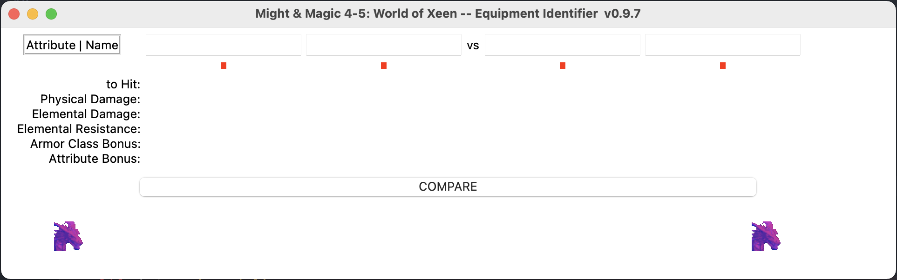



# Might & Magic IV & V - World of Xeen -- Id Equipment Stats.

## Python

### Introduction

It was compiled with info ~~stolen~~ borrowed from Stephen S. Lee (ssjlee@rawbw.com)'s gamefaqs page:
https://gamefaqs.gamespot.com/pc/932529-might-and-magic-world-of-xeen/faqs/63552

I made this when I was young so excuse the childishness

Make sure you have Python 3.4+.

### How to run

Run `world_of_xeen_equipmentcompare.py`

### Sample
Gotta have that 90's look. We can't be anachronistic.

